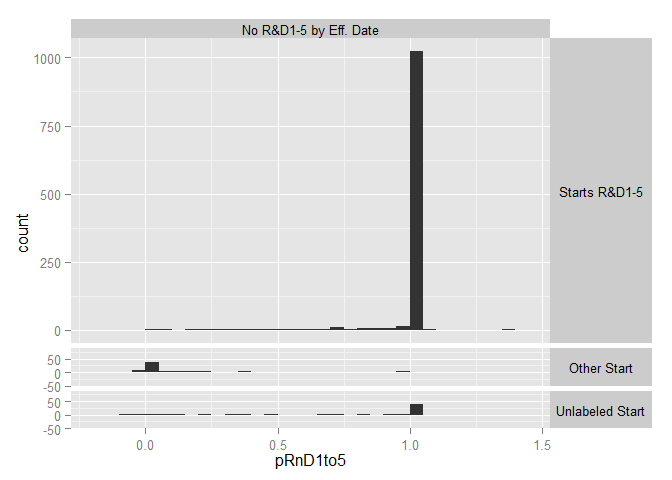
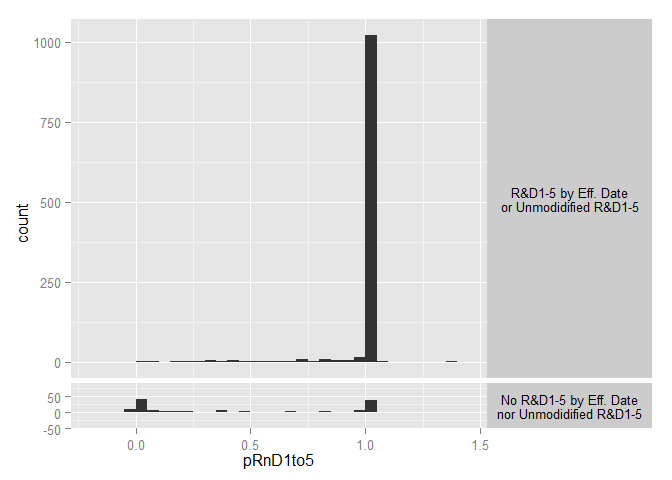

# DoD Fixed-Price Study
Greg Sanders  
Tuesday, January 13, 2015  

Contracts are classified using a mix of numerical and categorical variables. While the changes in numerical variables are easy to grasp and summarize, the move from being a research and development (R&D) contract and the like to a product contract requires deliberate consideration. As an important added factor, for the fixed-price study, we are only considering information that contracting officer knew going in. This is an attempt to avoid having our independent variables influenced by contract performance. For example, a standard of 50% R&D content by value would be influenced by whether the R&D portion of the project took longer than expected.

##Studying R&D contracts in the sample.
For this study we are looking at whether a contract includes the first five phases of R&D. We are considering a variety of different criteria, but have the benefit from the fact that R&D work should consistently occur at the front end of the data.


```r
require(ggplot2)
```

```
## Loading required package: ggplot2
```

```r
# setwd("K:\\Development\\Fixed-price")
setwd("C:\\Users\\Greg Sanders\\Documents\\Development\\Fixed-price")
contract.sample <-read.csv(
        paste("data\\defense_contract_CSIScontractID_sample_15000_SumofObligatedAmount.csv",sep=""),
        header=TRUE, sep=",", dec=".", strip.white=TRUE, 
        na.strings=c("NULL","NA",""),
        stringsAsFactors=FALSE
        )

contract.sample$firstSignedDateRnD1to5<-strptime(contract.sample$firstSignedDateRnD1to5,"%Y-%m-%d")
contract.sample$MinOfEffectiveDate<-strptime(contract.sample$MinOfEffectiveDate,"%Y-%m-%d")
contract.sample$isAnyRnD1to5<-factor(contract.sample$isAnyRnD1to5,levels=c(0,1),labels=c("No R&D1-5","Any R&D1-5"))
contract.sample$UnmodifiedRnD1to5<-factor(contract.sample$UnmodifiedRnD1to5
                                          ,levels=c(1,0),labels=c("Starts R&D1-5","Other Start"))
contract.sample$UnmodifiedRnD1to5<-addNA(contract.sample$UnmodifiedRnD1to5,ifany=TRUE)

levels(contract.sample$UnmodifiedRnD1to5)[is.na(levels(contract.sample$UnmodifiedRnD1to5))] <- "Unlabeled Start"
contract.sample$pRnD1to5<-contract.sample$obligatedAmountRnD1to5/contract.sample$SumofObligatedAmount
contract.sample$pRnD1to5[is.na(contract.sample$obligatedAmountRnD1to5)]<-0
contract.sample$simplearea<-addNA(contract.sample$simplearea,ifany=TRUE)
levels(contract.sample$simplearea)[is.na(levels(contract.sample$simplearea))] <- "Unlabeled\nor Mixed"

ggplot(
        data=subset(contract.sample,isAnyRnD1to5=="Any R&D1-5")
        ,aes_string(x="pRnD1to5")
        ,main="R&D(1-5) distribution by contract count"
        )+
        #         geom_bar(binwidth=0.05)+
        geom_bar(binwidth=0.05)+
        facet_grid( UnmodifiedRnD1to5 ~ .
                    , scales="free_y"
                    , space="free_y")+scale_y_continuous(expand=c(0,50))+
        theme(strip.text.y = element_text(angle = 360)
              )
```

 

```r
fiftysens<-nrow(contract.sample[contract.sample$pRnD1to5>=0.5&
                                        (contract.sample$UnmodifiedRnD1to5=="Starts R&D1-5"),])/
        nrow(contract.sample[contract.sample$pRnD1to5>=0.5,])


fiftyspec<-nrow(contract.sample[contract.sample$pRnD1to5<0.5&
                                        !(contract.sample$UnmodifiedRnD1to5=="Starts R&D1-5"),])/
        nrow(contract.sample[contract.sample$pRnD1to5<0.5,])

RnDsens<-nrow(contract.sample[contract.sample$simplearea=="R&D"&
                                      (contract.sample$UnmodifiedRnD1to5=="Starts R&D1-5"),])/
        nrow(contract.sample[contract.sample$simplearea=="R&D",])


RnDspec<-nrow(contract.sample[contract.sample$simplearea!="R&D"&
                                      !(contract.sample$UnmodifiedRnD1to5=="Starts R&D1-5"),])/
        nrow(contract.sample[contract.sample$simplearea!="R&D",])

nrow(contract.sample[contract.sample$pRnD1to5>=0.5,])
```

```
## [1] 1139
```

Based on this first analysis, it appears that labeling an R&D(1-5) contract by its first element works for at least 90% of cases. 

If we assume all contracts with 50% or more R&D(1-5) content by value are true R&D(1-5) contracts then the sensitivity (or true positive rate) is 0.9455663 and the specificity (or true negative rate) is 0.9983407.

If we assume all contracts that are exclusively R&D(1-5,7), when labeled, then the sensitivity (or true positive rate) is 0.9134355 and the specificity (or true negative rate) is 0.993737.


* The biggest problem appears to be those contracts whose first entry is not labeled. However, the vast majority of those contracts are 95%-100% R&D(1-5), which should make classifying them fairly easy. 
* Those contracts that start as non-R&D are consistently below 50% R&D(1-5) with a noteable exception in the 95% to 100% range. Capturing those should be simple.
* Those contracts that start R&D(1-5) but have less than 50% of dollars in that category might be false positives.


```r
contract.sample$isRnD1to5byStart<-NA
contract.sample$isRnD1to5byStart[contract.sample$firstSignedDateRnD1to5<=contract.sample$MinOfEffectiveDate]<-TRUE
contract.sample$isRnD1to5byStart[contract.sample$firstSignedDateRnD1to5>contract.sample$MinOfEffectiveDate]<-FALSE
contract.sample$isRnD1to5byStart[is.na(contract.sample$firstSignedDateRnD1to5)]<-FALSE
contract.sample$isRnD1to5byStart<-factor(contract.sample$isRnD1to5byStart
                                         ,levels=c(TRUE,FALSE),labels=c("R&D1-5 by Eff. Date","No R&D1-5 by Eff. Date")
                                         )

ggplot(
        data=subset(contract.sample,isAnyRnD1to5=="Any R&D1-5")
        ,aes_string(x="pRnD1to5")
        )+geom_bar(binwidth=0.05)+facet_grid(UnmodifiedRnD1to5~isRnD1to5byStart
                                             , scales="free_y"
                                             , space="free_y")+scale_y_continuous(expand=c(0,50))+
        theme(strip.text.y = element_text(angle = 360)
              )
```

 

If we include all contracts that either are labeled as R&D(1-5) in their unmodified version or before their effective date, then the sensitivity of the test improves by either standard without noteably reducing the specificity.


```r
contract.sample$isInitialRnD1to5<-NA
contract.sample$isInitialRnD1to5[!(contract.sample$UnmodifiedRnD1to5=="Starts R&D1-5"|
                                           contract.sample$isRnD1to5byStart=="R&D1-5 by Eff. Date ")]<-FALSE
contract.sample$isInitialRnD1to5[contract.sample$UnmodifiedRnD1to5=="Starts R&D1-5"]<-TRUE
contract.sample$isInitialRnD1to5[contract.sample$isRnD1to5byStart=="R&D1-5 by Eff. Date"]<-TRUE
contract.sample$isInitialRnD1to5<-factor(contract.sample$isInitialRnD1to5
                                         ,levels=c(TRUE,FALSE),labels=c("R&D1-5 by Eff. Date\nor Unmodidified R&D1-5"
                                                                        ,"No R&D1-5 by Eff. Date\nnor Unmodidified R&D1-5")
                                         )


ggplot(
        data=subset(contract.sample,isAnyRnD1to5=="Any R&D1-5")
        ,aes_string(x="pRnD1to5")
        )+geom_bar(binwidth=0.05)+facet_grid(isInitialRnD1to5~. , scales="free_y"
                                             , space="free_y")+scale_y_continuous(expand=c(0,50))+
        theme(strip.text.y = element_text(angle = 360)
              )
```

 

```r
fiftysens<-nrow(contract.sample[contract.sample$isInitialRnD1to5=="R&D1-5 by Eff. Date\nor Unmodidified R&D1-5"&
                                        contract.sample$pRnD1to5>=0.5,])/
        nrow(contract.sample[contract.sample$pRnD1to5>=0.5,])

fiftyspec<-nrow(contract.sample[contract.sample$isInitialRnD1to5=="No R&D1-5 by Eff. Date\nnor Unmodidified R&D1-5"&
                                        contract.sample$pRnD1to5<0.5,])/
        nrow(contract.sample[contract.sample$pRnD1to5<0.5,])

RnDsens<-nrow(contract.sample[contract.sample$isInitialRnD1to5=="R&D1-5 by Eff. Date\nor Unmodidified R&D1-5"&
                                      contract.sample$simplearea=="R&D",])/
        nrow(contract.sample[contract.sample$simplearea=="R&D",])


RnDspec<-nrow(contract.sample[contract.sample$isInitialRnD1to5=="No R&D1-5 by Eff. Date\nnor Unmodidified R&D1-5"&
                                      contract.sample$simplearea!="R&D",])/
        nrow(contract.sample[contract.sample$simplearea!="R&D",])
```
If we assume all contracts with 50% or more R&D(1-5) content by value are true R&D(1-5) contracts then the sensitivity (or true positive rate) is 0.9877085 and the specificity (or true negative rate) is 0.9980521.

If we assume all contracts that are exclusively R&D(1-5,7), when labeled, then the sensitivity (or true positive rate) is 0.9467989 and the specificity (or true negative rate) is 0.9926571.
